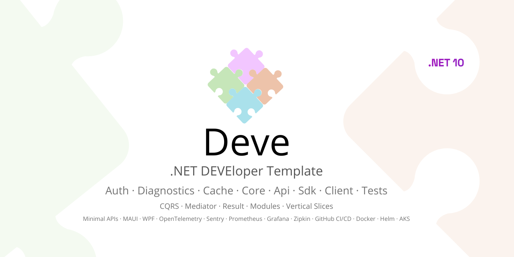
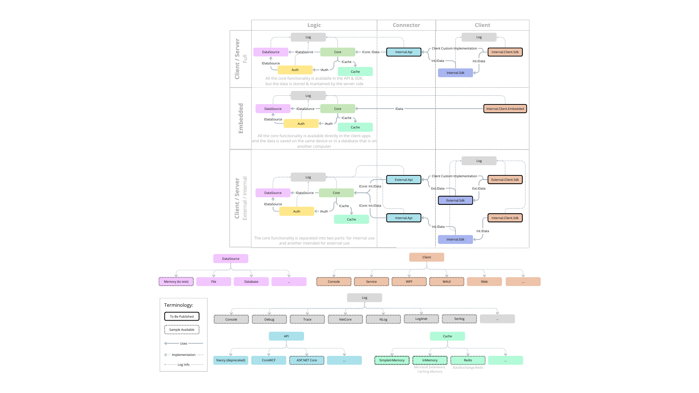

[](https://github.com/teracat/Deve/actions/workflows/main-test-all.yml)
[](https://www.nuget.org/packages/Teracat.Deve)

# Deve
Welcome to the **.NET DEVEloper Template**! This project serves as a starting point for developers who need to create applications with data access requirements. The template is designed to be flexible and adaptable, allowing you to change data access strategies without needing to overhaul the entire project.



## Installation

1. Install the template from Nuget:
```bash
dotnet new install Teracat.Deve
```

2. Create a project using the template:

```bash
dotnet new deve -n YourNewProjectName
```

For more information or alternative options, refer to the [Step-by-Step Installation Guide](https://github.com/teracat/Deve/wiki/Installation#step-by-step-installation-guide) in the Wiki section.

## Changelog & Roadmap

To stay up to date with the latest updates and changes to the project, you can check out our [Changelog](https://github.com/teracat/Deve/wiki/Changelog) and [Roadmap](https://github.com/teracat/Deve/wiki/Roadmap) in the Wiki section of the repository.

## Client Samples

Client app samples are provided to show how to use the Core or the Sdk + Api to access the data. More information in the [Wiki](https://github.com/teracat/Deve/wiki/Client) section.

MAUI Screenshots:

<a href="https://raw.githubusercontent.com/teracat/Deve/refs/heads/main/client-maui-login-windows.png" title="MAUI - Windows: Login Window"></a> 
<a href="https://raw.githubusercontent.com/teracat/Deve/refs/heads/main/client-maui-login-android.png" title="MAUI - Android: Login Window"></a>


WPF Screenshots:

<a href="https://raw.githubusercontent.com/teracat/Deve/refs/heads/main/client-wpf-login.png" title="WPF - Login Window"></a> 
<a href="https://raw.githubusercontent.com/teracat/Deve/refs/heads/main/client-wpf-main.png" title="WPF - Main Window"></a>


## Wiki

Read the documentation in the [Wiki](https://github.com/teracat/Deve/wiki) section for more information (still working on it):

- [Home](https://github.com/teracat/Deve/wiki)
  - [Main Objectives](https://github.com/teracat/Deve/wiki#main-objectives)
  - [Features](https://github.com/teracat/Deve/wiki#features)
  - [Project Structure](https://github.com/teracat/Deve/wiki#project-structure)
  - [Internal vs External](https://github.com/teracat/Deve/wiki#internal-vs-external)
  - [Client Embedded vs Sdk](https://github.com/teracat/Deve/wiki#client-embedded-vs-sdk)
  - [Publishable Projects](https://github.com/teracat/Deve/wiki#publishable-projects)
- [Installation](https://github.com/teracat/Deve/wiki/Installation)
  - [Prerequisites](https://github.com/teracat/Deve/wiki/Installation#prerequisites)
  - [Step-by-Step Installation Guide](https://github.com/teracat/Deve/wiki/Installation#step-by-step-installation-guide)
  - [Uninstall](https://github.com/teracat/Deve/wiki/Installation#uninstall)
  - [Install an Older Version](https://github.com/teracat/Deve/wiki/Installation#uninstall)
- [Common](https://github.com/teracat/Deve/wiki/Common)
  - [Constants](https://github.com/teracat/Deve/wiki/Common#constants)
  - [Utils](https://github.com/teracat/Deve/wiki/Common#utils)
  - [IDataCommon](https://github.com/teracat/Deve/wiki/Common#idatacommon)
  - [Model](https://github.com/teracat/Deve/wiki/Common#model)
  - [Criteria](https://github.com/teracat/Deve/wiki/Common#criteria)
  - [Localize](https://github.com/teracat/Deve/wiki/Common#localize)
  - [Log](https://github.com/teracat/Deve/wiki/Common#log)
- [Api](https://github.com/teracat/Deve/wiki/Api)
  - [Credentials](https://github.com/teracat/Deve/wiki/Api#credentials)
  - [Projects](https://github.com/teracat/Deve/wiki/Api#projects)
  - [Core](https://github.com/teracat/Deve/wiki/Api#core)
  - [User](https://github.com/teracat/Deve/wiki/Api#user)
  - [RateLimiter](https://github.com/teracat/Deve/wiki/Api#ratelimiter)
  - [StatusCode](https://github.com/teracat/Deve/wiki/Api#statuscode)
  - [Authentication](https://github.com/teracat/Deve/wiki/Api#authentication)
  - [Use cases](https://github.com/teracat/Deve/wiki/Api#use-cases)
- [Auth](https://github.com/teracat/Deve/wiki/Auth)
  - [ITokenManager](https://github.com/teracat/Deve/wiki/Auth#itokenmanager)
  - [ICrypt](https://github.com/teracat/Deve/wiki/Auth#icrypt)
  - [IHash](https://github.com/teracat/Deve/wiki/Auth#ihash)
  - [IAuth](https://github.com/teracat/Deve/wiki/Auth#iauth)
  - [Permissions](https://github.com/teracat/Deve/wiki/Auth#permissions)
- [Core](https://github.com/teracat/Deve/wiki/Core)
  - [Shared vs not Shared](https://github.com/teracat/Deve/wiki/Core#shared-vs-not-shared)
  - [CoreMain](https://github.com/teracat/Deve/wiki/Core#coremain)
  - [CoreBaseGet](https://github.com/teracat/Deve/wiki/Core#corebaseget)
  - [CoreBaseAll](https://github.com/teracat/Deve/wiki/Core#corebaseall)
  - [Shield](https://github.com/teracat/Deve/wiki/Core#shield)
  - [DataSourceWrappers](https://github.com/teracat/Deve/wiki/Core#datasourcewrappers)
  - [Use cases](https://github.com/teracat/Deve/wiki/Core#use-cases)
- [DataSource](https://github.com/teracat/Deve/wiki/DataSource)
  - [IDataSource](https://github.com/teracat/Deve/wiki/DataSource#idatasource)
  - [DataSourceMain](https://github.com/teracat/Deve/wiki/DataSource#datasourcemain)
  - [DataSourceConfig](https://github.com/teracat/Deve/wiki/DataSource#datasourceconfig)
  - [Data](https://github.com/teracat/Deve/wiki/DataSource#data)
  - [DataSourceBaseGet](https://github.com/teracat/Deve/wiki/DataSource#datasourcebaseget)
  - [DataSourceBaseAll](https://github.com/teracat/Deve/wiki/DataSource#datasourcebaseall)
  - [CriteriaHandler](https://github.com/teracat/Deve/wiki/DataSource#criteriahandler)
  - [Use cases](https://github.com/teracat/Deve/wiki/DataSource#use-cases)
- [Sdk](https://github.com/teracat/Deve/wiki/Sdk)
  - [Common](https://github.com/teracat/Deve/wiki/Sdk#common)
  - [External Sdk](https://github.com/teracat/Deve/wiki/Sdk#external-sdk)
  - [Internal Sdk](https://github.com/teracat/Deve/wiki/Sdk#internal-sdk)
  - [Use cases](https://github.com/teracat/Deve/wiki/Sdk#use-cases)
- [Client](https://github.com/teracat/Deve/wiki/Client)
  - [Common](https://github.com/teracat/Deve/wiki/Client#common)
  - [Console](https://github.com/teracat/Deve/wiki/Client#console)
  - [Service](https://github.com/teracat/Deve/wiki/Client#service)
  - [MAUI](https://github.com/teracat/Deve/wiki/Client#maui)
  - [WPF](https://github.com/teracat/Deve/wiki/Client#wpf)
- [Changelog](https://github.com/teracat/Deve/wiki/Changelog)
- [Roadmap](https://github.com/teracat/Deve/wiki/Roadmap)

## Contributing

If you find any errors or something that could be improved, please let me know by opening a new [Issue](https://github.com/teracat/Deve/issues) or [Discussion](https://github.com/teracat/Deve/discussions).

## License

This project is licensed under the MIT License. See the LICENSE file for more details.
