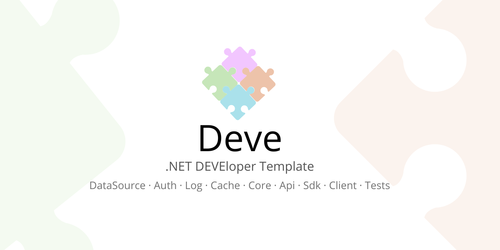

# Deve
Welcome to the **.NET DEVEloper Template**! This project serves as a starting point for developers who need to create applications with data access requirements. The template is designed to be flexible and adaptable, allowing you to change data access strategies without needing to overhaul the entire project.

## Features

- **Modular Structure**: The template is organized into distinct layers, making it easy to manage and extend. You can change on layer implementation without affecting other layers. For example, you can change the API implementaion from Nancy (which is deprecated) to ASP.NET Core and the rest of the projects will stay the same.
- **Flexible Data Access**: Easily switch between different data access methods (SQL Database -SQL Server, Oracle, MySQL, PostgreSQL...-, NoSQL Databases -MongoDB, Cosmos DB...-, using some framework -Entity Framework, Dapper...-, etc.) without significant changes to the codebase.
- **Best Practices**: Implements best practices for data access, ensuring maintainability and scalability.
- **Extensible**: Designed to be extended and customized to fit your specific needs.

### Prerequisites

- .NET SDK (version 8.0 or later)

## Project Structure

- **/Auth**: Contains definitions used to authenticate the user, to generate and validate tokens and to check permissions.
- **/Common**: Contains definitions used in the other projects and useful methods that can be used in any project.
- **/Common.Api**: Contains common definitions used in the Api projects.
- **/Common.Sdk**: Contains common definitions used in the Sdk projects.
- **/Core**: Contains business logic.
- **/DataSource**: Contains data access logic (from database, files, or any other data source).
- **/External**: Projects for external use (external parties). See next section.
- **/Internal**: Projects for internal use.
- **/Log**: Extra Log Providers that can be included in your projects to use other Log providers (NLog, log4net or NetCore system). In the Common there are some basic Log Providers (Console, Debug and Trace).
- **/Tests**: Tests on the other projects.

## Internal vs External

The following projects have two implementations: Internal & External.

- **Api**: Allow communication to the Core from another machine or application.
- **Client**: Presentation layer (application of any type: Console, Service, MAUI, WPF, Web, etc.).
- **Common**: Definitions used in internal/external projects. The definitions in Internal/Common won't be accessible from External projects.
- **Sdk**: Library used by the Clients to communicate with the Api.

If you plan to use the project for internal use and give access to external parties with restricted functionalities, then you can separate the definitions using both projects.

If you will use it only for internal use, then use only the Internal project but keep the structure; you might need to add the external projects in the future.

## Client: Embedded vs Sdk

Embedded Clients do not use the SDK; instead, they include the Core in the project so you can deploy an application that does not need an API to be used. This could be an application that accesses a Database which is in the same computer or network.

Sdk Clients use the SDK project, which means that the Api will have to be deployed. It is up to you where the Api is deployed. This is useful if you plan to deploy the Api project to the cloud.

In the Client applications, you should use the IData interface as the connector to the data. This way, you can change your application from Embedded to Sdk, or vice versa, just by changing the referenced project and the class used as the IData implementation. Just take into account to pick the IData from the Internal/Common project for internal projects.

## Publishable Projects

- Clients
- Internal/Api
- External/Api
- External/Sdk (Internal will be used directly in your internal clients, it doesn't need to be deployed)

## Documentation

You can read the project documentation in the Wiki section (still working on it):

https://github.com/teracat/Deve/wiki

## Still working on

- Tests
- Client samples
- Wiki

## Contributing

If you find any errors or something that could be improved, please let me know.

## License

This project is licensed under the MIT License. See the LICENSE file for more details.
